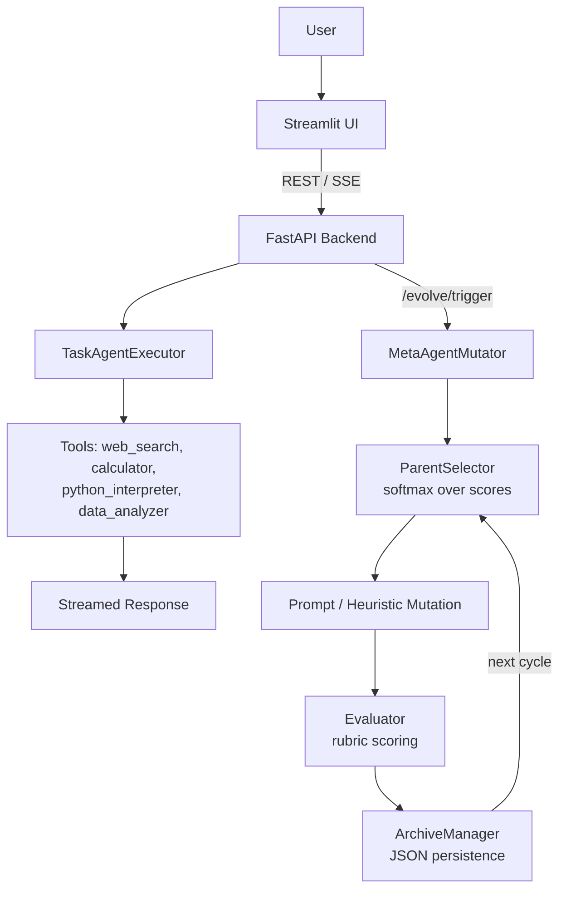

# 🧬 Hyperion

Hyperion is a self-improving agent framework: a FastAPI backend runs a tool-using **TaskAgent**, scores its outputs, mutates its prompt, and archives each resulting "generation," while a Streamlit dashboard visualizes the evolution across generations.


---

## Why Hyperion?

**Traditional AI agent**
fixed prompt → fixed behavior → repeated execution, no feedback loop.

**Hyperion**
execute → evaluate → analyze results → mutate prompt/heuristics → select the best-performing generation → evaluate again.

The full loop — archiving, scoring, mutation, selection, and diffing — runs end-to-end. In the current build, the scoring and mutation steps use deterministic/heuristic logic rather than live LLM calls, which makes the system fast to run and easy to demo without API costs, and gives it a clean seam to swap in real model calls next.

---

## What Is Hyperion?

Hyperion is a FastAPI + Streamlit application built around four subsystems in `backend/app/hyperagent/`:

- **TaskAgent** — routes a query to a tool (web search, calculator, Python interpreter, or data analyzer) and streams a formatted response over SSE.
- **MetaAgent** — produces each new generation by selecting a parent and applying one of a rotating set of directive mutations to its prompt.
- **Parent Selection** — chooses which past generation to evolve from next, weighted by score via softmax sampling.
- **Evaluator** — scores each generation against a fixed rubric and reports token/cost estimates.

Generations are persisted to a JSON archive (`archive.py`), exposed through a FastAPI layer with SSE streaming, and visualized through a Streamlit frontend that includes a side-by-side prompt diff viewer.

---

## System Architecture



The Streamlit UI talks to the FastAPI layer over REST and SSE. Chat queries flow through the TaskAgent and its tools; evolution cycles flow through parent selection, mutation, and evaluation, with each result persisted to the archive for the next cycle to build on.

---

## Core Components

| Component | Responsibility |
|---|---|
| TaskAgent | Streams a tool-augmented response to a user query, using the active generation's prompt and heuristics |
| MetaAgent | Produces the next generation by selecting a parent and applying a mutation directive |
| Parent Selection | Softmax-weighted sampling over generation scores |
| Evaluator | Produces a rubric score and token/cost estimate for a generation |
| Archive | Generation records persisted to JSON, with lookup and history access |
| FastAPI | Chat, evolution, and history endpoints, several streamed via SSE |
| Streamlit | Chat interface and evolution dashboard, including a side-by-side diff viewer |

---

## Self-Improvement Loop

**Generation G0** — a baseline prompt seeded with an initial score, created automatically on first run.

**Execute** — the TaskAgent handles a query using the active generation's prompt and tool logic.

**Evaluate** — the Evaluator scores the generation against the rubric below and records the result.

**Select Parent** — softmax sampling picks a generation to evolve from, weighted toward higher scores.

**Mutate** — a new prompt is produced by applying a directive mutation to the parent.

**Generation G(n+1)** — the new generation is archived with a link back to its parent.

**Repeat** — each cycle can draw on the full archive of prior generations.

---

## Agent Execution

`TaskAgentExecutor` streams a sequence of SSE events per query — status, reasoning, tool call, observation, and a token-streamed final answer — and loads whichever generation's prompt and heuristics are requested via `generation_id` (defaulting to the latest). Different generations produce differently formatted output: later generations wrap answers in a more structured Markdown format than the baseline.

Tool routing currently uses keyword matching on the query (math symbols or "calculate" → calculator; "code"/"python" → interpreter; "analyze"/"metric"/"trend" → data analyzer; otherwise → web search).

---

## Evolution Mechanism

Parent selection implements genuine softmax temperature scaling over generation scores:

$$P(g_i) = \frac{\exp(S(g_i) / \tau)}{\sum_j \exp(S(g_j) / \tau)}$$

Generations with higher scores are proportionally more likely to be selected as parents, while lower-scoring generations retain a nonzero chance of selection — preserving diversity in the evolutionary search rather than collapsing immediately onto the single best performer.

Mutation is applied via a rotating set of directive templates (covering explicit step-by-step reasoning, tool-call efficiency, and structured output formatting) appended to the parent's prompt.

---

## Evaluation

Each generation is scored against a fixed rubric:

- **Correctness** — 40%
- **Tool Efficiency** — 30%
- **Reasoning Clarity** — 20%
- **Speed/Cost** — 10%

The evaluator also tracks estimated token usage and cost per generation, and a benchmark suite (`test_suite.json`) defines 5 tasks spanning math, retrieval, code execution, logic, and multi-step orchestration.

---

## Tech Stack

| Category | Technologies |
|---|---|
| Backend | FastAPI, Pydantic / pydantic-settings, Uvicorn |
| Agent / Evolution | Custom Python orchestration (`langgraph`, `langchain-core` listed as dependencies for planned integration) |
| Frontend | Streamlit, `requests` for SSE consumption |
| Evaluation | Matplotlib, NumPy |
| Infrastructure | Docker Compose (backend + frontend services) |

---

## Repository Structure

```text
Hyperion/
├── backend/
│   ├── app/
│   │   ├── api/
│   │   │   ├── chat.py         # POST /chat/stream
│   │   │   ├── evolve.py       # POST /evolve/trigger, GET /evolve/status
│   │   │   └── evolution.py    # GET /evolution/history, /generations/{id}, /evolution/diff
│   │   ├── hyperagent/
│   │   │   ├── task_agent.py
│   │   │   ├── meta_agent.py
│   │   │   ├── selection.py
│   │   │   ├── evaluator.py
│   │   │   ├── archive.py
│   │   │   └── tools.py
│   │   ├── config.py
│   │   └── main.py
│   └── evaluation/
│       ├── run_eval.py
│       ├── plot_generator.py
│       └── test_suite.json
├── frontend/
│   ├── app.py
│   ├── views/
│   └── utils/
│       ├── api_client.py
│       └── diff_utils.py
├── docker-compose.yml
├── run_demo.py                 # CLI launcher: --eval / --backend / --frontend
└── README.md
```

---

## Getting Started

### Prerequisites
- Python 3.10+
- Docker & Docker Compose (for the containerized path)

### Docker

```bash
docker-compose up --build
```

- Backend docs: `http://localhost:8000/docs`
- Streamlit UI: `http://localhost:8501`

### Local Development

```bash
# Backend
pip install -r backend/requirements.txt
uvicorn app.main:app --app-dir backend --host 0.0.0.0 --port 8000 --reload

# Frontend (separate terminal)
pip install streamlit plotly pandas
streamlit run frontend/app.py
```

### Or, via the launcher script

```bash
python run_demo.py --backend    # start the FastAPI server
python run_demo.py --frontend   # start the Streamlit UI
python run_demo.py --eval       # run the 5-generation evaluation pipeline
```

### Environment Variables

| Variable | Purpose |
|---|---|
| `HOST`, `PORT` | Backend bind address (default `0.0.0.0:8000`) |
| `OPENAI_API_KEY`, `GEMINI_API_KEY` | Reserved for planned LLM integration |
| `MOCK_MODE` | Toggles simulation mode; surfaced on `/health` |
| `BACKEND_URL` | Frontend → backend base URL (default `http://localhost:8000`) |

Consider adding a `.env.example` documenting these for new contributors.

---

## API Endpoints

| Endpoint | Method | Purpose |
|---|---|---|
| `/chat/stream` | POST | SSE stream of TaskAgent execution events for a query |
| `/evolve/trigger` | POST | SSE stream of a single evolution cycle (select → mutate → evaluate → archive) |
| `/evolve/status` | GET | Summary: total generations, latest generation id/score, baseline score, improvement delta |
| `/evolution/history` | GET | All archived generations |
| `/generations/{gen_id}` | GET | A single generation by ID |
| `/evolution/diff` | GET | Diff and score comparison between two generations |
| `/health` | GET | Service status |

---

## Frontend

**Chat View** — interactive interface for querying the TaskAgent, streaming responses token-by-token via SSE.

**Evolution Dashboard** — triggers evolution cycles, displays generation history, and renders a side-by-side prompt diff between any two generations (`diff_utils.py`), with additions and deletions highlighted.

All backend communication runs through `api_client.py`, including health checks, history and diff retrieval, and SSE consumption for both chat and evolution streams.

---

## Evaluation & Experiments

```bash
python backend/evaluation/run_eval.py
# or
python run_demo.py --eval
```

Running the pipeline executes 5 evolution cycles and generates two visualizations in `backend/evaluation/plots/`:

- `score_progression.png` — score trajectory across generations
- `rubric_breakdown.png` — category-level comparison between the baseline and the latest generation

The evaluation pipeline visualizes score changes across generations produced by the current heuristic scorer.

---

## Design Decisions

- **Separate TaskAgent and MetaAgent** — keeps query-answering and evolution logic independently testable, and lets either be upgraded to a live LLM-backed implementation without touching the other.
- **JSON-file archive** — the simplest persistence layer for a single-process app; a natural first candidate to move to a database as usage grows.
- **SSE over WebSockets** — simpler client code for one-directional progress and token streaming.
- **Dedicated evaluation pipeline** — separates benchmark runs from the interactive API/UI path.

---

## Limitations

- Agent reasoning, mutation, and scoring currently use deterministic/heuristic logic rather than live LLM calls; `OPENAI_API_KEY`/`GEMINI_API_KEY` are reserved for that integration.
- `web_search` and `data_analyzer` return pattern-matched responses rather than live data.
- `calculator` and `python_interpreter` evaluate expressions directly and should be sandboxed before handling untrusted input.
- CORS currently allows all origins — tighten before any non-local deployment.
- The archive is a single JSON file with no write locking, which won't hold up under concurrent evolution triggers.
- No automated test suite yet.

---

## Future Improvements

*(future work, not current functionality)*

- Wire `OPENAI_API_KEY` / `GEMINI_API_KEY` into live LLM calls for the TaskAgent, MetaAgent, and Evaluator.
- Condition mutations on actual evaluation feedback rather than a fixed rotation.
- Run the benchmark suite's tasks through the TaskAgent directly to produce evaluation results.
- Move generation storage to a database.
- Add automated regression tests.
- Tighten CORS and sandbox the code-execution tools.

---

## Contributing

```text
Fork → Create branch → Make changes → Run tests/evaluation → Open Pull Request
```

---

## License

This project currently does not include an explicit open-source license.
